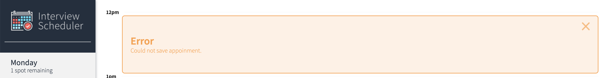
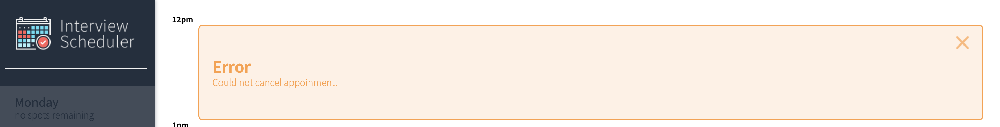

# Interview Scheduler

Interview Scheduler is a single-page application (SPA) that allows users to book technical interviews between students and mentors. The front end of this project is built with React and makes requests to an API to fetch and store appointment data from a database.

# Final Product

## Features
- Interviews can be booked between between the hours of 12 PM and 5 PM, Monday to Friday.
- A user can book an interview in an empty appointment slot.
- Interviews are booked by typing in a student name and clicking on an interviewer from a list of available interviewers.
- A user can cancel an existing interview.
- A user can edit the details of an existing interview.
- The list of days informs the user how many slots are available for each day.
- The expected day updates the number of spots available when an interview is booked or canceled.

## Screenshots
### Initial view


### Book an interview


### Cancel an interview


### Validate student name input is not blank before saving an interview


### Validate an interviewer is selected before saving an interview


### Show an error if an interview cannot be saved


### Show an error if an interview cannot be cancelled


## Getting Started
1. Fork this repository, then clone it onto your local device.
2. Fork the [scheduler-api](https://github.com/shujie1st/scheduler-api) repository, then clone it onto you local device. Follow the instructions to setup the Scheduler API server.
3. Install dependencies using the `npm install` command.
4. Start this app using the `npm start` command. The app will be served at http://localhost:8000/.

## Running Jest Test Framework
```sh
npm test
```
## Running Storybook Visual Testbed
```sh
npm run storybook
```

## Dependencies
    "axios": "^0.20.0",
    "classnames": "^2.2.6",
    "normalize.css": "^8.0.1",
    "react": "^16.9.0",
    "react-dom": "^16.9.0",
    "react-scripts": "3.4.4"

## devDependencies
    "@babel/core": "^7.4.3",
    "@storybook/addon-actions": "^5.0.10",
    "@storybook/addon-backgrounds": "^5.0.10",
    "@storybook/addon-links": "^5.0.10",
    "@storybook/addons": "^5.0.10",
    "@storybook/react": "^5.0.10",
    "@testing-library/jest-dom": "^4.0.0",
    "@testing-library/react": "^8.0.7",
    "@testing-library/react-hooks": "^8.0.1",
    "babel-loader": "8.1.0",
    "prop-types": "^15.8.1",
    "react-test-renderer": "^16.9.0",
    "sass": "^1.53.0"